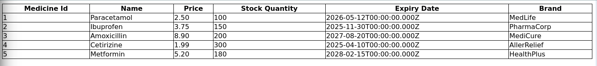
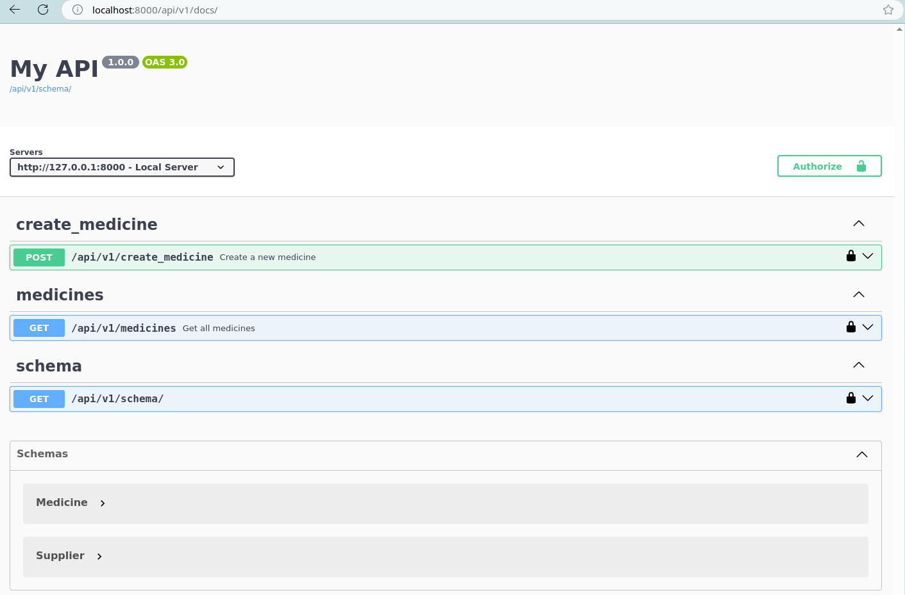

## Description

The project is a small scale django react typescript project to demonstrate OpenAPI's swagger auto documentation generator to help sync backend types with frontend typescript to avoid unexpected type mismatch.

## How to use

After the backend is running using `./manage.py runserver`, from the webclient folder run `pnpm generate-api` which will run the generate-api script from package.json. Running the command will generate a folder under the react project root called "api" which contains all the API calls and the types it accepts.

when the API generation is successful, you should get the following output in the terminal.

```
################################################################################
# Thanks for using OpenAPI Generator.                                          #
# Please consider donation to help us maintain this project 🙏                 #
# https://opencollective.com/openapi_generator/donate                          #
################################################################################
```

## Screenshots

### Frontend table.




### Backend auto-generated API documentation.

